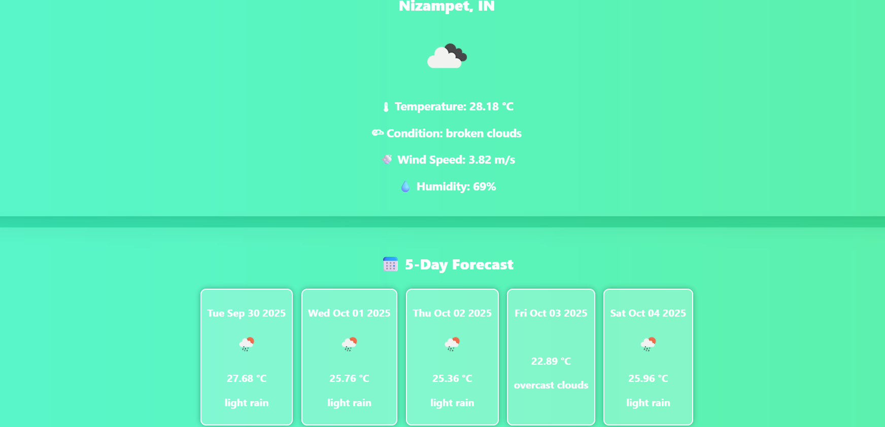
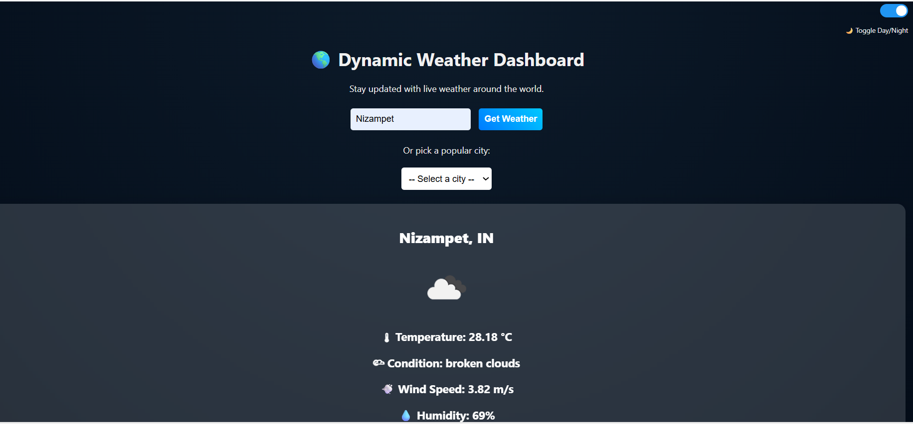

# Dynamic Weather Dashboard  

Welcome to the Dynamic Weather Dashboard – your pocket-friendly weather companion 🌍.  
This project brings real-time weather updates and a 5-day forecast for cities across the globe,with modern interface.  

Think of it as a lightweight alternative to big weather apps — clean, simple, and built to show you only what you need!  

Instead of opening heavy apps, I wanted something minimal, fast, and fun that anyone can use in their browser.  


#Features
1.Current weather updates – temperature, humidity, and wind speed  
2.5-day forecast– daily summaries with easy-to-read icons  
3.Day/Night mode – toggle between light & dark themes 🌙☀️  
4.Search any city worldwide – instant results  
5.Quick city picks – London, Tokyo, New York, Hyderabad 🌏  
6.Responsive design – works on desktops, tablets, and phones  


#Built With
1.HTML5 → clean structure  
2.CSS3 → animations, gradients, responsive layouts  
3.JavaScript (ES6)→ fetching data & rendering dynamically  
4.OpenWeatherMap API→ powering real-time weather data  


#📷 Screenshots

#🌞 Day Mode


#5-Day Forecast


#🌙 Night Mode



#📚 Getting Started
Want to run this locally? Follow these simple steps:  

1.Clone the repo  
   ```bash
   git clone https://github.com/your-username/Weather-Dashboard.git
